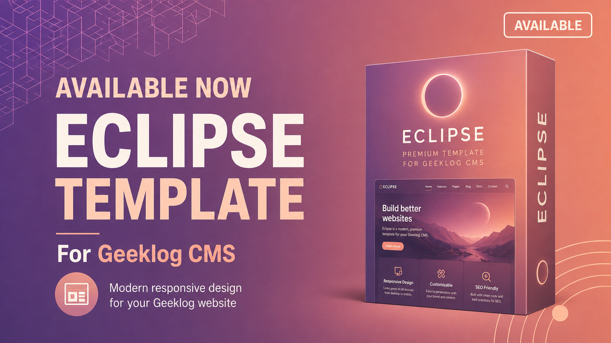

# Eclipse for Geeklog

Eclipse is a modern, responsive and customizable theme for Geeklog CMS. It focuses on readable public pages, a more comfortable editorial workflow, accessible navigation and a built-in Theme Studio.

> **Stable release:** `1.0.0` supports Geeklog 2.1.1 and 2.2.2 on PHP 5.6 through 8.1. Back up the site before installation or update.

## Highlights

- Mobile-first public layout with optional sidebars.
- Four navigation styles and five accessible palette presets.
- Native rendering for hierarchical menus supplied by the Geeklog Menu plugin.
- Refined Geeklog administration pages, forms, tables and story editor.
- Theme Studio with live preview, palettes, update upload, history and rollback.
- SEO and editorial helpers, local draft recovery and configurable social sharing.
- Settings, footer links, palettes and history stored as protected JSON in `{path_data}-eclipse/`.
- Local ZIP updates with integrity validation, safety backup and automatic Geeklog template-cache clearing.

## Requirements

- Geeklog 2.1.1 or later.
- The `denim` theme must remain installed because Eclipse inherits compatibility templates from it.
- PHP 5.6 is the supported parsing baseline; a currently maintained PHP version is strongly recommended.
- Permission to create the protected sibling `{path_data}-eclipse/`; writable temporary storage is also required for ZIP updates.
- PHP `ZipArchive` only when using Theme Studio's local update installer.

See [COMPATIBILITY.md](eclipse/COMPATIBILITY.md) for the detailed compatibility status.

## Install Eclipse

1. Download the versioned ZIP from the GitHub **Releases** page, not GitHub's automatic source archive.
2. Back up the site files and database.
3. Extract the archive so the resulting directory is `public_html/layout/eclipse/`.
4. Keep `public_html/layout/denim/` installed.
5. Select Eclipse in Geeklog and clear the template cache once.
6. Test the home page, a full article, login/password recovery and Command and Control.

Existing Eclipse installations can upload the release ZIP from **Command and Control → Theme Studio → Updates**.

## Testing and feedback

Please test at 360, 768, 1024 and 1440 CSS pixels where possible. The highest-value checks are:

- public home, topic, article, search, login and comment pages;
- mobile multi-level navigation with every palette and menu style;
- administration dashboard, lists, configuration and story editor;
- Theme Studio save, preview, archive update and rollback;
- keyboard navigation, visible focus, 200% zoom and reduced motion;
- browser console, PHP log, missing images and horizontal overflow.

Use the [release QA checklist](eclipse/QA-CHECKLIST.md) and report reproducible problems in [GitHub Issues](https://github.com/hostellerie/eclipse/issues). Include the Geeklog, PHP and browser versions, the selected palette/menu style, the page route and a screenshot when relevant. Do not publish credentials, private paths or session data.

## Repository layout

- `eclipse/` — exact installable theme tree and integrity manifest.
- `quality/` — development-only manifest and contract validation tools.
- `RELEASE-NOTES.md` — release notes and release-candidate history.

Development tools are deliberately excluded from the installable theme archive.

## License

Eclipse is distributed under the [GNU General Public License v2 or later](LICENSE).
